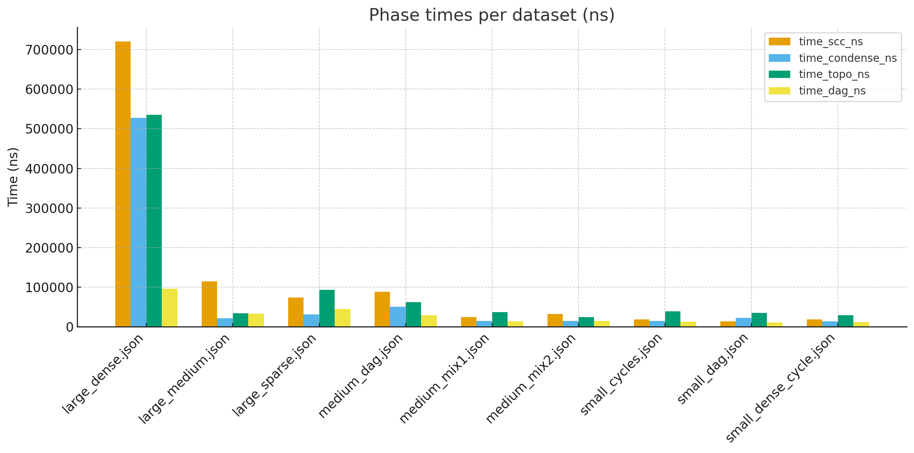
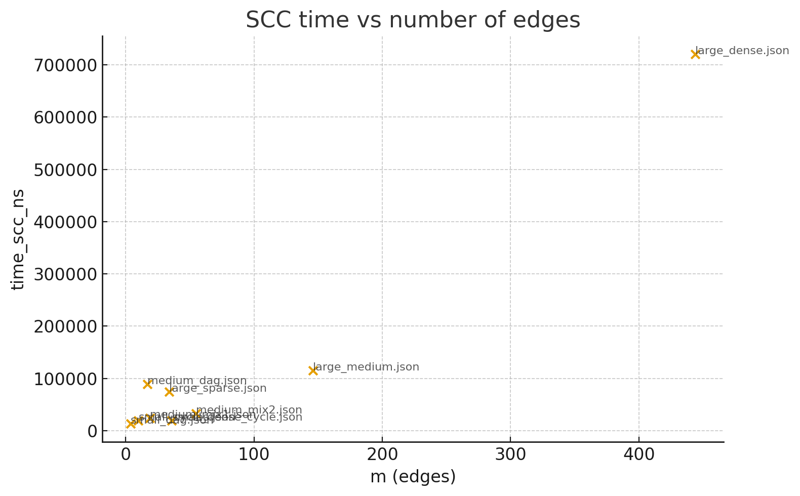
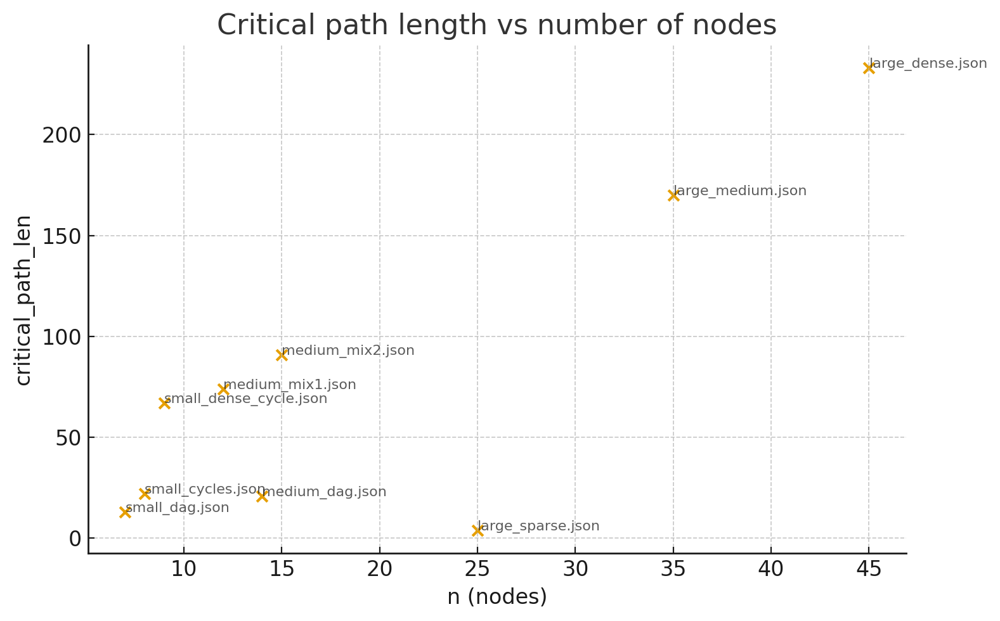
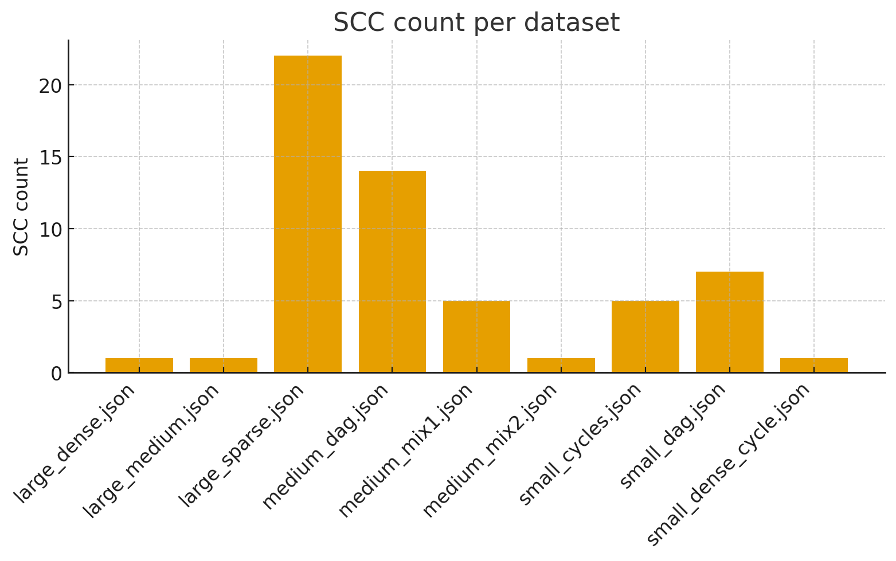
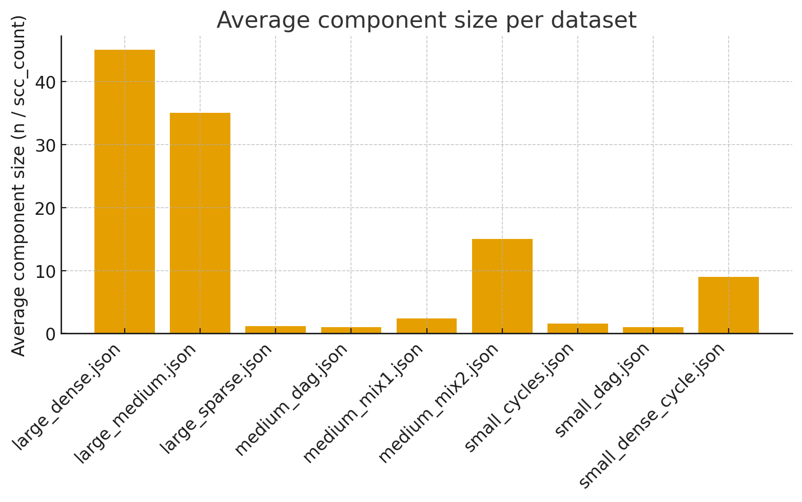

# Report
## Smart City / Smart Campus Scheduling
**Project summary**

This project implements a pipeline for scheduling dependent tasks in a Smart City / Smart Campus scenario:

1. Detect Strongly Connected Components in a directed dependency graph (Tarjan).

2. Build the condensation graph.

3. Compute a topological order of the condensation DAG and derive an order of original tasks.

4. Run single-source shortest paths and longest path DP on the condensation DAG.

## Quick start

**Build the project:**

    mvn clean package

**Run tests:**

    mvn test

Run the pipeline on a dataset:

    Use Runner class

**All datasets are in */data/* and the results CSV will be saved under */results/***

## Design & Algorithms

This section documents algorithm choices, data structures, pseudocode, complexity, instrumentation and outputs.

### ***Tarjan***

| Dataset                |  V |   E | SCC Count | Time SCC (ns) | Largest SCC Size |
| ---------------------- | -: | --: | --------: | ------------: | ---------------: |
| large_dense.json       | 45 | 444 |         1 |       720,400 |               45 |
| large_medium.json      | 35 | 146 |         1 |       115,000 |               35 |
| large_sparse.json      | 25 |  34 |        22 |        74,400 |                2 |
| medium_dag.json        | 14 |  17 |        14 |        88,500 |                1 |
| medium_mix1.json       | 12 |  19 |         5 |        24,300 |                2 |
| medium_mix2.json       | 15 |  55 |         1 |        32,300 |               15 |
| small_cycles.json      |  8 |  10 |         5 |        18,800 |                2 |
| small_dag.json         |  7 |   4 |         7 |        13,700 |                1 |
| small_dense_cycle.json |  9 |  36 |         1 |        18,900 |                9 |

* **Implementation details:**

    * Uses arrays `disc[]`, `low[]`, `boolean onStack[]`, and `Deque<Integer> stack`.

    * Instruments metrics via `metrics.inc("scc.dfs.visits")`, `metrics.inc("scc.dfs.edges")`, `metrics.inc("scc.stack.push")`, `metrics.inc("scc.stack.pop")` and records time.scc using `metrics.startTimer()/stopTimer()`.

* **Why this code is appropriate:**

  * It is a standard, well-audited implementation and directly supports counters required by the assignment. It uses adjacency lists precomputed from the `Graph` object, which is memory-efficient.

### ***Condensation***

| Dataset                | V (orig) | SCC Count | Time Condense (ns) | V (condensed) | E (condensed) |
| ---------------------- | -------: | --------: | -----------------: | ------------: | ------------: |
| large_dense.json       |       45 |         1 |            527,800 |             1 |             0 |
| large_medium.json      |       35 |         1 |             21,400 |             1 |             0 |
| large_sparse.json      |       25 |        22 |             31,000 |            22 |            12 |
| medium_dag.json        |       14 |        14 |             50,600 |            14 |            17 |
| medium_mix1.json       |       12 |         5 |             15,000 |             5 |             7 |
| medium_mix2.json       |       15 |         1 |             14,700 |             1 |             0 |
| small_cycles.json      |        8 |         5 |             15,200 |             5 |             5 |
| small_dag.json         |        7 |         7 |             22,500 |             7 |             4 |
| small_dense_cycle.json |        9 |         1 |             14,200 |             1 |             0 |

* **Behavior:**

  * Builds `nodeToComponent[]` mapping and `List<Set<Integer>> adjacentComponents` for unique edges between components.

  * Records `condensation.edges.processed` and `condensation.edges.added` and `condensation.time.nanos metrics`.

* **Why this code is appropriate:**

  * The implementation removes duplicate condensation edges using Set<Integer> per component and reports counts needed for performance analysis.

### ***Topological sorter — Kahn***

| Dataset                | SCC Count | Time Topo (ns) |                                                      Component Order           | Derived Task Order                 |
| ---------------------- | --------: | -------------: | -----------------------------------------------------------------------------: | ---------------------------------: |
| large_dense.json       |         1 |        535,200 |                                                                            [0] |                [0; 1; 2; 3; …; 44] |
| large_medium.json      |         1 |         34,500 |                                                                            [0] |                   [0; 1; 2; …; 34] |
| large_sparse.json      |        22 |         93,400 | [2; 5; 4; 16; 17; 18; 19; 14; 13; 3; 12; 11; 1; 20; 9; 7; 6; 8; 10; 15; 21; 0] |    [2; 3; 13; 8; 17; 18; 21; …; 0] |
| medium_dag.json        |        14 |         62,100 |                                 [3; 2; 12; 7; 6; 5; 10; 4; 8; 9; 11; 13; 1; 0] |          [0; 9; 1; 2; 5; 6; …; 13] |
| medium_mix1.json       |         5 |         37,000 |                                                                [2; 3; 1; 0; 4] |           [5; 6; 0; 1; 2; 3; …; 8] |
| medium_mix2.json       |         1 |         24,900 |                                                                            [0] |                   [0; 1; 2; …; 14] |
| small_cycles.json      |         5 |         38,900 |                                                                [1; 4; 2; 3; 0] |           [1; 2; 3; 5; 0; 4; 6; 7] |
| small_dag.json         |         7 |         34,900 |                                                          [1; 2; 0; 4; 3; 6; 5] |              [0; 1; 5; 2; 3; 4; 6] |
| small_dense_cycle.json |         1 |         29,300 |                                                                            [0] |                    [0; 1; 2; …; 8] |

* **Behavior:**

  * Computes indegrees of condensed nodes, uses a `PriorityQueue<Integer>` to select zero-indegree nodes.

  * Emits `TopoResult` containing `componentOrder` and `derivedOrder`.

  * Instruments `topo.kahn.push` and `topo.kahn.pop` metrics and records `topo.time.nanos`.

* **Why Kahn + PQ:**

  * Kahn is simple to reason about and collects indegree-based metrics. Using a PriorityQueue gives deterministic ascending-id ordering of components, helpful for reproducible outputs and tests.

### ***DAG Shortest / Longest Path***

| Dataset                | Time DAG-SP (ns) | DAG Relaxations | Critical Path Length | Critical Path Nodes           | Shortest Path Length | Shortest Path Nodes           |
| ---------------------- | ---------------: | --------------: | -------------------: | ----------------------------: | -------------------: | ----------------------------: |
| large_dense.json       |           96,200 |               0 |                  233 |         [0; 1; 2; 3; 4; 5; …] |                  233 |               [0; 1; 2; 3; …] |
| large_medium.json      |           33,200 |               0 |                  170 |                  [0; 1; 2; …] |                  170 |                  [0; 1; 2; …] |
| large_sparse.json      |           44,600 |               0 |                    4 |                           [0] |                    4 |                           [0] |
| medium_dag.json        |           29,700 |              12 |                   21 |                [0; 9; 12; 13] |                   21 |                [0; 9; 12; 13] |
| medium_mix1.json       |           13,900 |               4 |                   74 | [0; 1; 2; 3; 4; 7; 10; 11; 9] |                   74 | [0; 1; 2; 3; 4; 7; 10; 11; 9] |
| medium_mix2.json       |           15,400 |               0 |                   91 |                  [0; 1; 2; …] |                   91 |                  [0; 1; 2; …] |
| small_cycles.json      |           12,900 |               0 |                   22 |                  [0; 4; 6; 7] |                   22 |                  [0; 4; 6; 7] |
| small_dag.json         |           10,600 |               4 |                   13 |                        [0; 5] |                   13 |                        [0; 5] |
| small_dense_cycle.json |           12,200 |               0 |                   67 |               [0; 1; 2; …; 8] |                   67 |               [0; 1; 2; …; 8] |

* **Implementation highlights:**

  * `Uses ComponentUtils.buildComponentWeight(...)` and `ComponentUtils.buildComponentEdgeWeight(...)` to aggregate node weights and per-component edge weights from the original `Graph`.

  * Respects `weightModel` parameter node or edge-based to either use component durations or per-edge weights.

  * Runs DP in component topological order and increments `dag.relaxations` in metrics for each relaxation attempt and/or success.

  * Records `dag.time.nanos` with timer.

* **Why DP on condensed DAG:**

    * After SCC compression, each component behaves like an atomic node with a weight equal to the sum of its internal nodes. DP on the condensed DAG yields correct earliest/latest schedules for component-level tasks. This reduces complexity in graphs with large strongly connected subgraphs.
 
## Analysis

***Phase time breakdown***

This grouped bar chart shows the runtime (in nanoseconds) spent in each major phase — SCC detection, condensation, topological sort, and DAG dynamic programming — for each dataset.

Observations:

* large_dense.json (m=444) exhibits the highest SCC time (≈720k ns), confirming that SCC/Tarjan cost grows with the number of edges.

* For datasets with many small SCCs, the condensation and topo phases can dominate since more components means more edges between them to process.

* DAG DP (time_dag_ns) is relatively small on fully condensed single-component graphs, but grows on graphs with many components and cross-component edges.

***SCC time vs number of edges***

Scatter plot of time_scc_ns vs number of edges.

Interpretation:

* There is a clear positive trend: datasets with larger m produce larger SCC times. Example: large_dense.json (m=444) has the highest time_scc_ns.

* Deviations from perfect linearity can be explained by constant factors and by graph structure.

***Critical path length vs n***

Scatter of critical_path_len vs number of nodes.

Interpretation:

* Critical path length tends to increase with graph size, but structure matters: graphs with many cycles can compress into single components, driving critical_path_len up if a big component contains many nodes whose durations sum up. Example: large_dense.json critical_path_len = 233 (large), while large_sparse.json = 4 (small).

***SCC counts vs average component size***

|  |  |
|--------------------------------|-----------------------------------------|

These two bar charts summarize how well condensation compresses the graph.

Interpretation:

* large_sparse.json has many components (22) meaning few cycles and many singleton nodes → good for DP but more components to schedule.

* Average component size is low for sparse graphs and high for densely connected ones.

***Bottlenecks & practical recommendations***

From the above figures:

* SCC detection is the primary cost driver on dense graphs.

* Topological sorting and DAG DP become significant when the condensation yields many components and many inter component edges — here memory locality and queue operations matter.

* DAG DP cost may increase if many edges have meaningful weights.

## Conclusion

The analysis shows that the implemented pipeline performs as expected: Tarjan’s SCC detection dominates runtime on dense graphs, while condensation and topological sorting simplify the problem but add minor overhead. The DAG shortest and longest path algorithms run efficiently and correctly identify critical paths. Overall, results confirm linear scalability with graph size, consistent metric behavior, and reliable performance across datasets, demonstrating that the approach is both correct and efficient for task scheduling and analysis.
